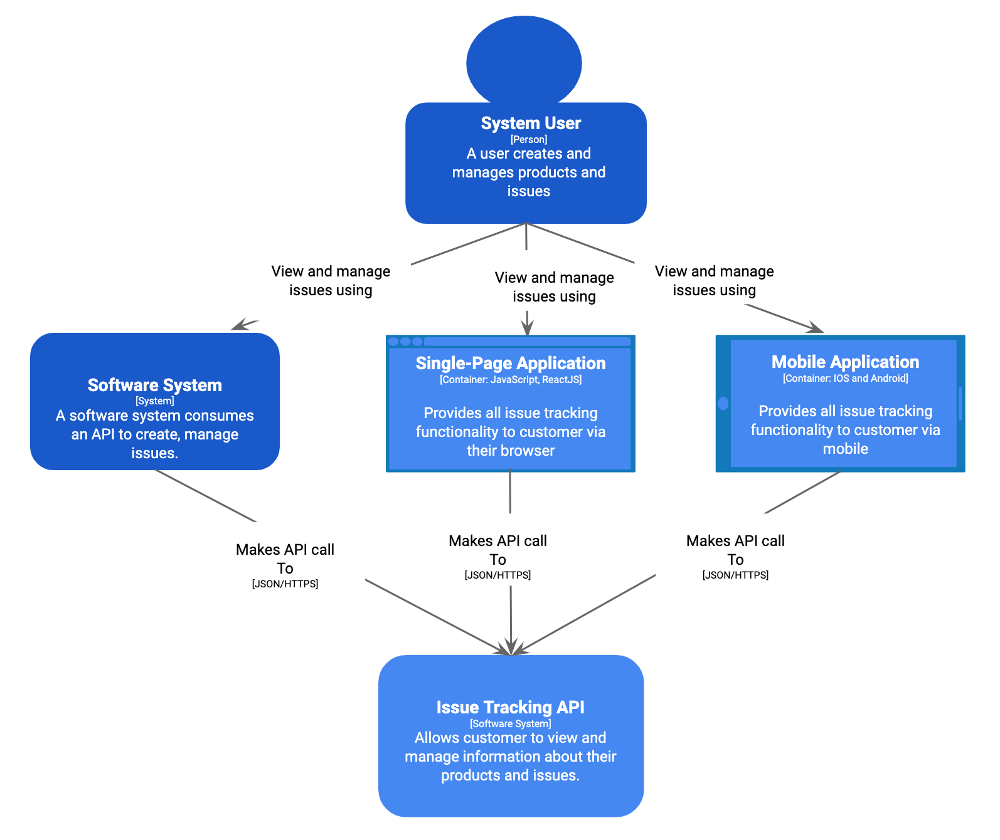
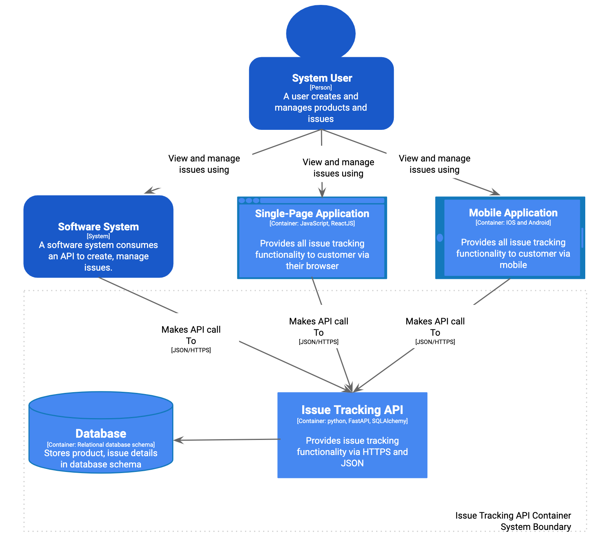
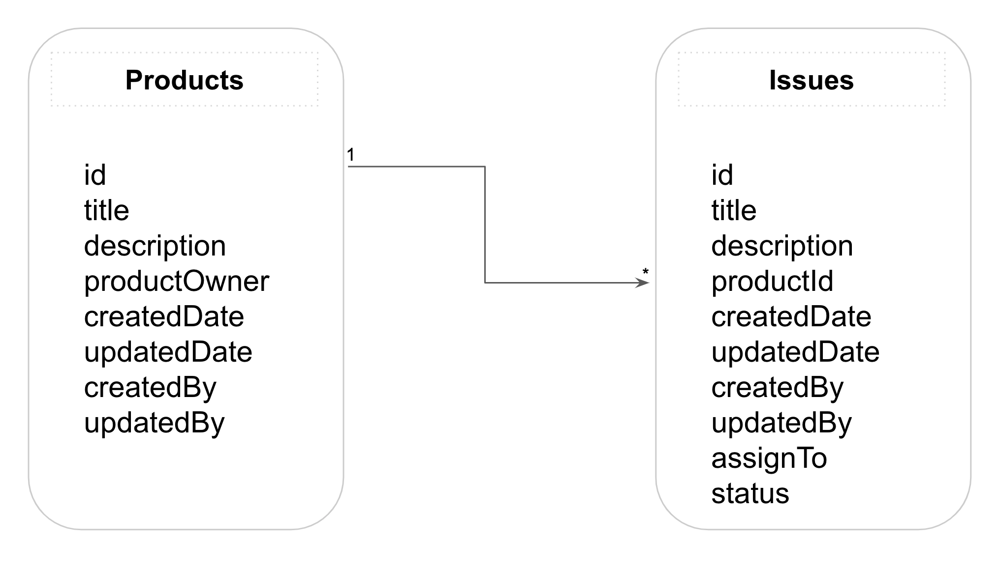

# Issue Tracker
This repository contains a restful api developed using TDD to demonstrate an approach to creating an api using:-
* [Fast API](https://fastapi.tiangolo.com/)
* [Uvicorn](https://www.uvicorn.org/)
* [Postgres](https://www.postgresql.org/)
* [Python](https://www.python.org/)
* [SQL Alchemy](https://www.sqlalchemy.org/)
* [Pydantic](https://pydantic-docs.helpmanual.io/)
* [PyTest](https://docs.pytest.org/en/stable/)
* [Docker](https://www.docker.com/)
* [PyTest-cov](https://pypi.org/project/pytest-cov/)

## Architecture
It's a simple "Issue Tracking API" allows user to create, manage products and issues against the product. This is intentionally kept simple and basic. 

**Note:** API clients like Software System, Single Page Application and Mobile Application are not included in this code base. There are here to explain the context of Issue Tracking API as potential clients.

### System Context

<p align="center">
 
</p>

### Issue Tracker Container

The system consists of an API and backend database system. An API uses [SQL Alchemy](https://www.sqlalchemy.org/) as an [ORM](https://en.wikipedia.org/wiki/Object-relational_mapping) to perform [CRUD](https://en.wikipedia.org/wiki/Create,_read,_update_and_delete) operations against the database. The API also performs basic validation of data using [Pydantic](https://pydantic-docs.helpmanual.io/).


<p align="center">
 
</p>

### Database Schema
I have decided to keep the database schema simple. As mentioned above I am using Postgres database and SQL Alchemy to perform CRUD operations.

<p align="center">
 
</p>

## Setup Environment
Create .env file in the root directory:-

**Note:** Must not check this file to github or code repository. This will expose your credentials.

```
POSTGRES_USER_NAME=<YOUR DATABASE USER>
POSTGRES_USER_PASSWORD=<YOUR DATABASE PASSWORD>
POSTGRES_DB_NAME=<YOUR DATABASE NAME>
```

### Build and Run
Build the container instances using the following command:-

```
docker-compose up -d --build
```
The above command will build the container before running it in detached mode.

### Run Tests
Run the following command to run the tests:-

```
docker-compose exec web pytest .
```
### Check the Status of an API
Access the API using HTTP client of your choice like [Insomnia](https://insomnia.rest/) or [Postman](https://learning.postman.com/)

```
http://localhost:8002/status/
```
The above route show following response when API is running.

```
{
  "status": "ok"
}
```
### API Documentation
Please visit the following URL to view the documentation. The documentation is powered by [Swagger UI](https://swagger.io/tools/swagger-ui/):-

```
http://localhost:8002/docs
```